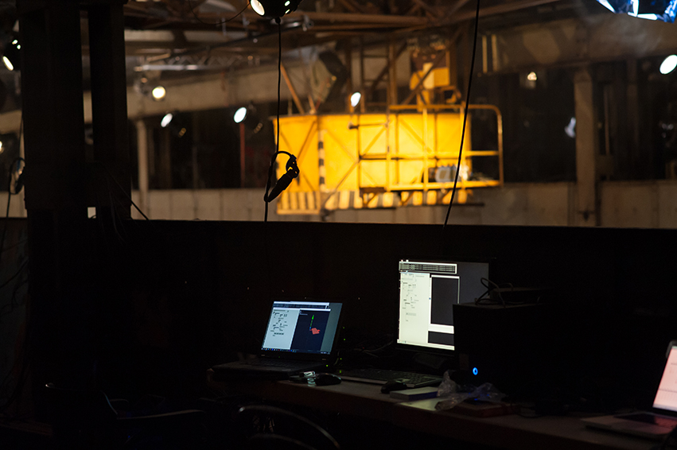
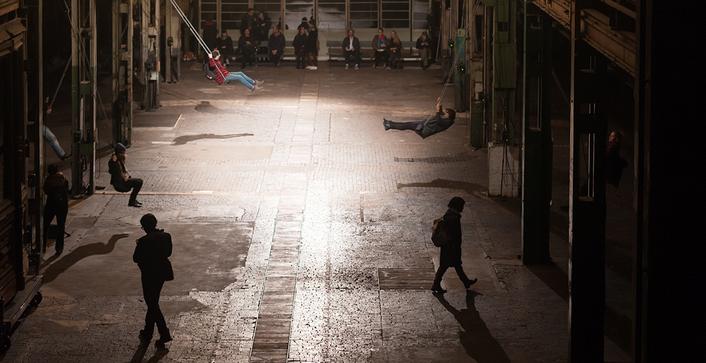
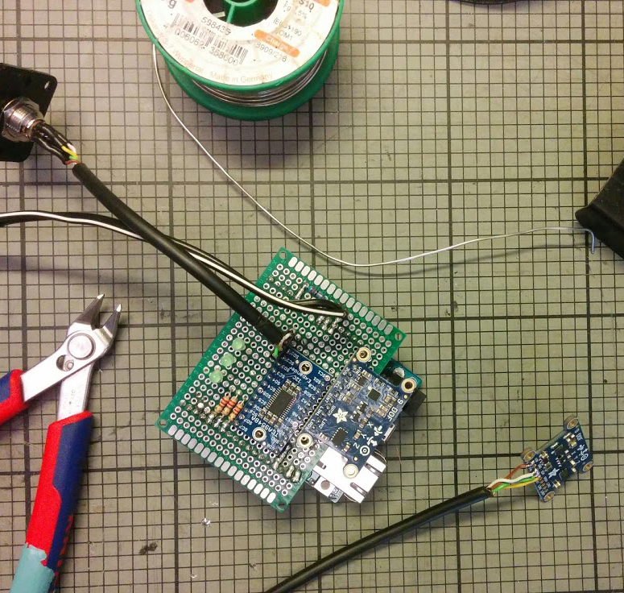
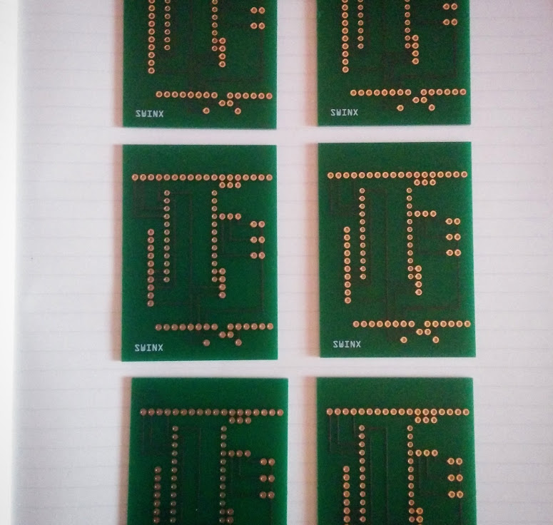
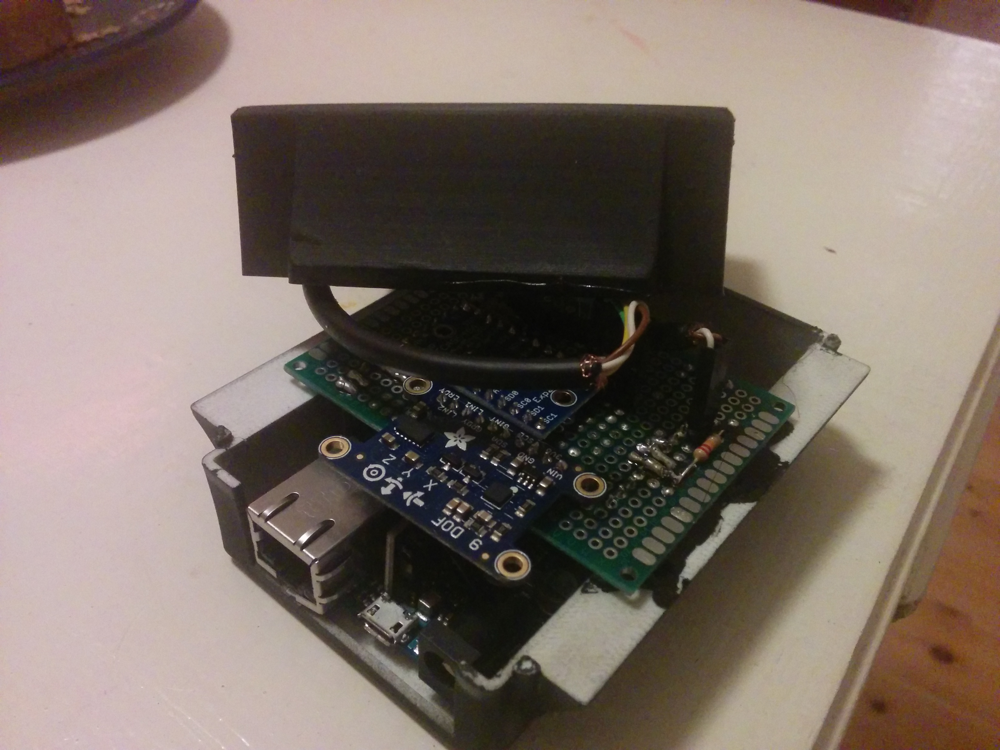
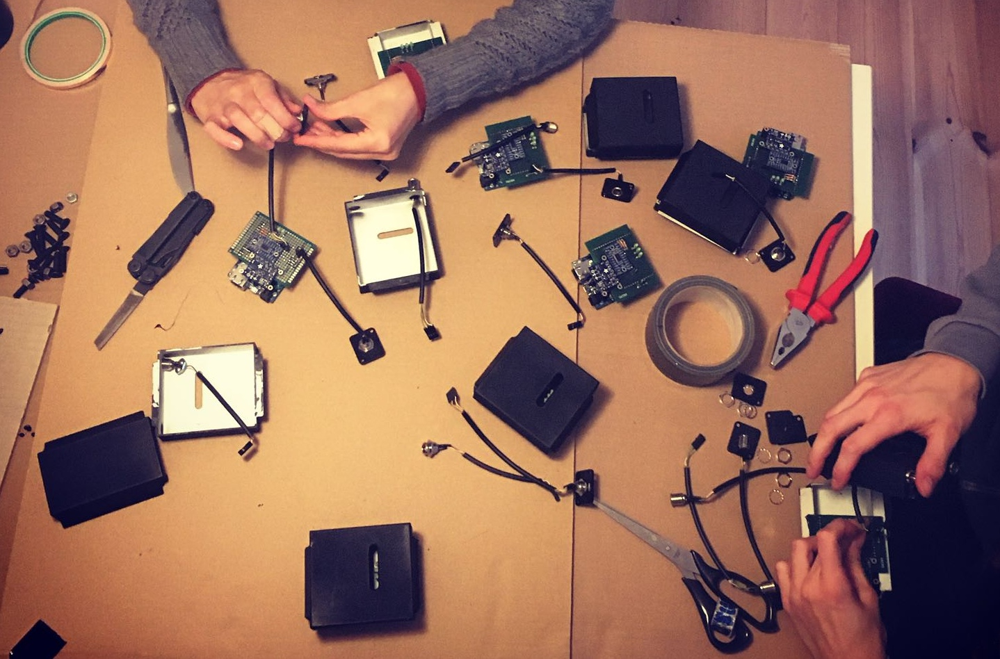

# lost on the highest peak

Legacy project developed 2015-2016.

Code repository for an interactive sound installation — 8 Arduino microcontrollers with touch sensors and two IMUs attached to 8 swings in a large industrial space, controlling sound interactively via vvvv and [VVVV.Audio](https://github.com/tebjan/VVVV.Audio).

**Arduino:** Power over Ethernet, UDP to vvvv. Requires Adafruit 9DOF libraries (LSM303, L3GD20) and Arduino Ethernet.

*Naxoshalle, Frankfurt, 2016*

## Exhibition at Naxoshalle Frankfurt in collaboration with Künstler*innenhaus Mousonturm

## PCB Design & Prototyping

---

## Enclosure

3D-printable housing for Arduino + IMU sensor units:

| Part | File |
|------|------|
| Lid (Deckel) | [deckel.STL](arduino/housing/deckel.STL) |
| Base (Unterschale) | [unterschale.STL](arduino/housing/unterschale.STL) |
| Sensor housing — lid | [Sensorhuelle_Deckel.stl](arduino/housing/Sensorhuelle_Deckel.stl) |
| Sensor housing — base | [Sensorhuelle_unterteil.stl](arduino/housing/Sensorhuelle_unterteil.stl) |

*On GitHub, clicking an STL link opens an interactive 3D viewer — you can rotate and zoom.*

---

